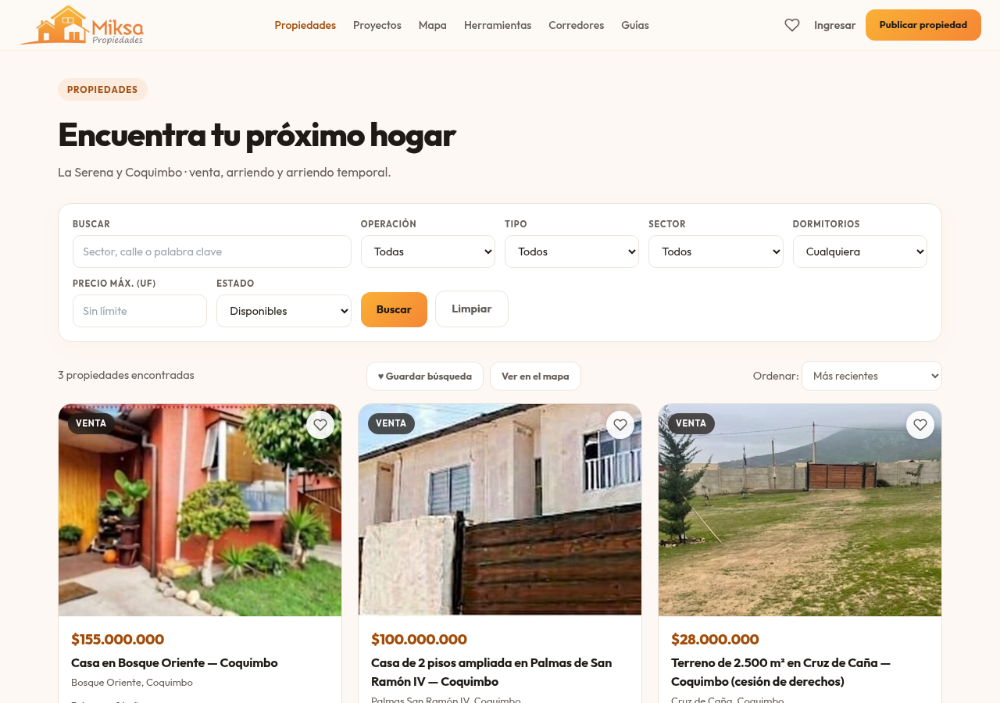
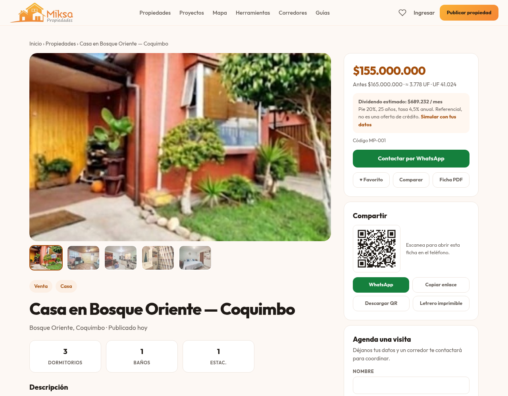
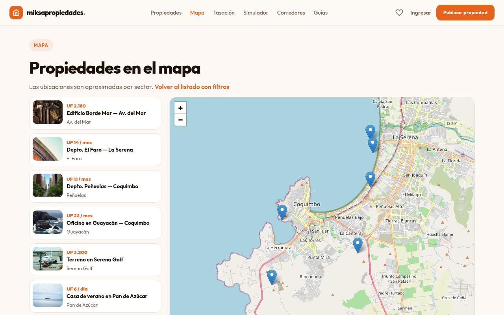
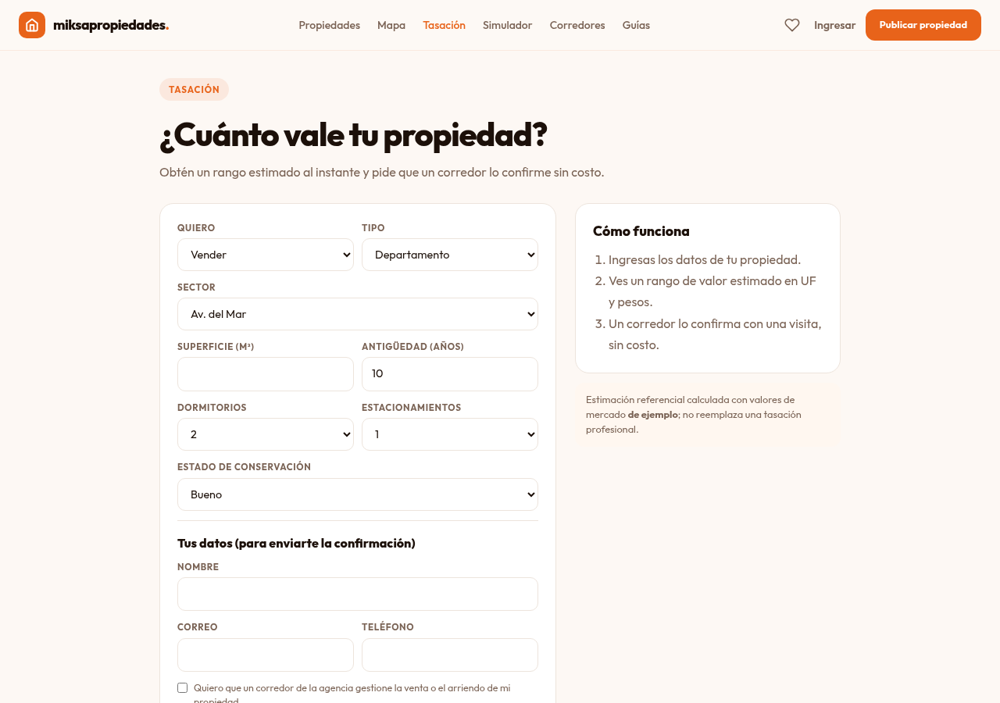

<div align="center">


**La agencia naranja de La Serena y Coquimbo**

Portal inmobiliario con búsqueda, mapa por propiedad, tasación online, simulador hipotecario y panel para corredores.
Frontend estático: **HTML + CSS + JavaScript puro**, sin dependencias ni paso de compilación.


### 🌐 [Ver el sitio en vivo → savkacarvajal.github.io/miksapropiedades](https://savkacarvajal.github.io/miksapropiedades/)


</div>

---

## ✨ Qué incluye

### Para quien busca propiedad (comprar o arrendar)
| | |
|---|---|
| 💰 **¿Cuánto puedo comprar?** | Precio máximo según tu ingreso, deudas y ahorro, indicando si te limita el ingreso o el pie. |
| 🔎 **Encárgale tu búsqueda** | Describes qué buscas, ves al instante cuántas propiedades coinciden y un corredor sigue buscando por ti. Puede guardar la búsqueda para avisarte. |
| 🔎 **Listado con filtros** | Operación, tipo, sector, dormitorios, precio máximo y estado. Los filtros viajan en la URL, así que se pueden compartir. |
| 🗺️ **Mapa** | Leaflet + OpenStreetMap, con lista lateral sincronizada. Cada ficha incluye además su propio mapa: zona referencial del sector o punto exacto, con «Cómo llegar». |
| 🏡 **Ficha completa** | Precio en pesos exacto (o en UF), etiqueta de cesión de derechos, galería, gastos comunes, contribuciones, orientación, subsidio, video/tour, corredor asignado y propiedades similares. |
| 💱 **UF en vivo** | Precio en pesos con la UF del día ([mindicador.cl](https://mindicador.cl)) y dividendo estimado. |
| 🧮 **Simulador hipotecario** | Pie en pesos (con su % del precio), plazo y tasa a tu medida, con ingreso mensual sugerido. El pie también es en CLP en costos de compra, rentabilidad y arrendar vs comprar. |
| 📈 **Rentabilidad** | Cap rate, flujo mensual, retorno sobre tu capital y TIR de una propiedad para arriendo, con gráfico. |
| 🧾 **Costos de compra** | Notaría, conservador, timbres y tasación: cuánto dinero necesitas además del pie. |
| ⚖️ **Arrendar vs comprar** | Patrimonio a 10 o más años y año de equilibrio. |
| 🏗️ **Proyectos nuevos** | En blanco, en construcción o entrega inmediata; plan de pagos y cotización. |
| 📲 **Compartir** | WhatsApp, enlace, código QR y letrero imprimible por propiedad. |
| ❤️ **Favoritos y comparador** | Guarda propiedades y compara hasta 3 lado a lado. |
| 🔔 **Búsquedas guardadas** | Cuenta cuántas propiedades nuevas aparecieron desde que la guardaste. |
| 🏘️ **Barrios y guías** | Una página por barrio y guías sobre arriendo seguro, contribuciones, subsidio y compra. |

### Para propietarios y corredores
| | |
|---|---|
| 📝 **Publicar en 4 pasos** | Fotos reducidas en el navegador, ubicación exacta opcional marcada en el mapa (dentro de La Serena–Coquimbo), datos legales opcionales y enlace a video. |
| 📐 **Tasación online** | Rango estimado en UF y pesos; opción de que la agencia gestione la propiedad. |
| 📅 **Agenda de visitas** | Formulario en cada ficha; el panel exporta cada visita al calendario (`.ics`). |
| 📊 **Panel de corredor** | CRM con estados (nuevo → cerrado), agenda, estadísticas por aviso y exportación CSV. |
| 🏷️ **Estado del aviso** | Disponible, reservada, vendida o arrendada. |
| 📄 **Ficha en PDF** | Vista de impresión lista para enviar al cliente. |

<details>
<summary><b>📸 Más capturas</b></summary>

<br>

| Listado | Ficha |
|---|---|
|  |  |

| Mapa | Tasación |
|---|---|
|  |  |

<p align="center"></p>

</details>

---

## 🚀 Empezar

```sh
git clone https://github.com/savkacarvajal/miksapropiedades.git
cd miksapropiedades
python3 -m http.server 8000
# abrir http://localhost:8000
```

> Hay que servirlo por HTTP (`localhost` cuenta como contexto seguro). Abrirlo con `file://` desactiva WebCrypto y el login no funciona.

## 🧭 Páginas

| Archivo | Función |
|---|---|
| `index.html` | Portada: buscador, destacados, servicios |
| `listado.html` | Listado con filtros, orden, favoritos y comparador |
| `propiedad.html?id=…` | Ficha de la propiedad |
| `mapa.html` | Mapa de propiedades |
| `herramientas.html` | Centro de calculadoras |
| `simulador.html` · `rentabilidad.html` · `costos.html` · `arrendar-vs-comprar.html` | Hipotecario, rentabilidad de inversión (cap rate, flujo, TIR), costos de compra y arrendar vs comprar |
| `presupuesto.html` · `busco.html` | Lado comprador: capacidad de compra y encargo de búsqueda a un corredor |
| `tasacion.html` | Tasación online referencial |
| `proyectos.html` · `proyecto.html?id=…` | Proyectos nuevos con tipologías, plan de pagos y cotización |
| `letrero.html?id=…` | Letrero imprimible con código QR |
| `favoritos.html` · `comparar.html` | Favoritos y comparador |
| `corredores.html` · `barrio.html?s=…` | Equipo y landing por barrio |
| `blog.html` · `blog/*.html` | Guías |
| `publicar.html` · `ingresar.html` · `mis-avisos.html` | Cuenta y avisos propios |
| `panel.html` | Panel de corredor (requiere configuración, ver abajo) |
| `privacidad.html` · `terminos.html` | Textos legales **base** |
| `404.html` | Página de error |

## ⚙️ Configuración

Todo lo propio de la agencia está en **`js/config.js`**:

```js
AGENCIA:      { whatsapp: '56912345678', telefono: '', email: '' },  // botones de contacto
ADMIN_EMAILS: ['corredor@tuagencia.cl'],                             // habilita panel.html
CORREDORES:   [ { id, nombre, cargo, registro, tel, email, bio } ],  // hoy son de ejemplo
```

Después de editar el menú o el footer, replícalos en todas las páginas:

```sh
python3 tools/sync-layout.py
```

### 🏠 Cargar propiedades reales

Las propiedades de la agencia están en `REALES` (`js/common.js`), con sus fotos en `img/propiedades/`. Cada una lleva:

```js
{ id: 'MP-001', tipo: 'casa', op: 'venta', titulo, descripcion, sector: 'Bosque Oriente',
  precioCLP: 155000000,          // precio exacto en pesos (se muestra tal cual)
  precio: 3780,                  // UF referencial, usado por filtros y cálculos
  precioAnterior, comision: 2, cesionDerechos: false,
  contacto: { nombre, apellido, tel }, fotos: ['img/propiedades/…jpg'] }
```

Un sector nuevo se agrega en `SECTORES` y `COORDS` (`js/common.js`), en los selectores de `listado.html`, `publicar.html` y `busco.html`, y en `BARRIOS` (`js/barrio.js`). Con `lat`/`lng` en el aviso, la ficha muestra el punto exacto en vez de la zona del sector.

Las propiedades de demostración (`SEED`, fotos de picsum) quedan **ocultas**; se activan con `localStorage.miksa_demo = 1` y las usan las pruebas automáticas.

### 🔧 Datos de ejemplo que debes reemplazar

- Proyectos (`PROYECTOS`) en `js/common.js` y los corredores de `js/config.js` (siguen siendo de ejemplo).
- `SITIO_URL` en `js/config.js`: dominio que llevarán los códigos QR y enlaces compartidos.
- Porcentajes por defecto de costos de compra en `costos.html` (referenciales y editables).
- Tabla de UF/m² de la tasación: `js/tasacion.js` → `BASE_UF_M2`.
- Descripciones de barrios: `js/barrio.js` → `BARRIOS`.
- Testimonios: `index.html` (están rotulados como "de ejemplo").
- Textos legales: `privacidad.html` y `terminos.html` son borradores; revísalos con un abogado.

## ✅ Pruebas

```sh
pip install -r tests/requirements.txt
python3 tests/run.py
```

Chequeos estáticos, más de 400 comprobaciones en Chrome real (formularios, cálculos, mapas, XSS, panel…), un barrido de humo/responsive de todas las páginas en escritorio y móvil y una auditoría de accesibilidad (contraste WCAG AA, nombres accesibles y estructura), con la red externa simulada. `python3 tests/run.py --only ficha` corre un solo caso. Se ejecutan también en GitHub Actions en cada push. Detalle en [`tests/README.md`](tests/README.md).

## 🗂️ Estructura

```
├── index.html, listado.html, propiedad.html, …   páginas
├── blog/                                          guías
├── js/
│   ├── config.js        configuración de la agencia
│   ├── store.js         única capa de acceso a datos (hoy localStorage; base para pasar a Supabase)
│   ├── common.js        utilidades, propiedades reales y demo, sectores, UF, QR
│   ├── pin-mapa.js      selector de ubicación exacta al publicar
│   ├── finanzas.js      crédito, TIR, rentabilidad, arrendar vs comprar, costos
│   ├── actions.js       despacha los data-act (no hay JS inline)
│   └── <pagina>.js      lógica de cada página
├── styles.css           reset + componentes
├── img/                 logos (claro y oscuro) y fotos de las propiedades
├── vendor/leaflet/      Leaflet 1.9.4 (mapa), alojado localmente
├── vendor/qrcode/       qrcode-generator 1.4.4 (QR), alojado localmente
├── vendor/fonts/        tipografía Outfit (woff2), alojada localmente
├── tests/               pruebas (run.py, cases/, lib/), se ejecutan en CI
├── .github/workflows/   GitHub Actions: pruebas en cada push
├── tools/sync-layout.py sincroniza menú y footer
├── _headers             cabeceras de seguridad (Cloudflare Pages / Netlify)
└── SEGURIDAD.md         verificación OWASP Top 10 / ASVS 5.0
```

## 🔐 Seguridad

- **CSP estricta**: `script-src 'self'`, sin scripts ni handlers inline.
- Contraseñas con **PBKDF2-SHA256** (150 mil iteraciones y sal por usuario).
- Todo texto de usuario se renderiza con `textContent`; escape de HTML donde se usa `innerHTML`.
- Validación de fotos (JPG/PNG/WebP, 5 MB), enlaces de video con lista blanca de dominios, honeypot anti-bots.
- Exportación CSV neutraliza inyección de fórmulas.

La verificación completa está en [`SEGURIDAD.md`](SEGURIDAD.md).

> ⚠️ **Limitación importante:** hoy usuarios, avisos, leads y favoritos viven en `localStorage`. Es una **maqueta funcional**: los avisos no se comparten entre visitantes y el panel no tiene control de acceso real. Eso se resuelve con el backend (ver hoja de ruta).

## ☁️ Deploy

| Plataforma | Notas |
|---|---|
| **Cloudflare Pages / Netlify** *(recomendado)* | Publicar la raíz, sin comando de build. `_headers` aplica HSTS, `frame-ancestors`, `X-Frame-Options` y demás. |
| **GitHub Pages** *(activo hoy)* | Publica la rama `master` en https://savkacarvajal.github.io/miksapropiedades/. Ignora `_headers`: solo queda la CSP por `<meta>`. |

El navegador consulta estos servicios externos (todos declarados en la CSP): mindicador.cl (UF), teselas de OpenStreetMap y picsum.photos (fotos de las propiedades de demostración, ocultas por defecto). Las tipografías (Outfit, OFL) van dentro del repo.

## 🛣️ Hoja de ruta

- [ ] **Supabase**: Auth con correo verificado, Postgres con Row Level Security y Storage para fotos.
- [ ] Alertas por correo de búsquedas guardadas.
- [ ] Edición de avisos.
- [ ] `sitemap.xml`, `og:image` y dominio propio.
- [x] Primeras propiedades reales cargadas (3), con logo y paleta de la marca.
- [ ] Fotos originales de las propiedades (hoy recortadas de los afiches), superficie construida y ubicación exacta.
- [ ] Reemplazar corredores y proyectos de ejemplo por datos reales.

---

<div align="center">
<sub>Hecho para La Serena y Coquimbo · Las 3 propiedades publicadas son reales; los corredores, proyectos y valores de tasación siguen siendo de ejemplo.</sub>
</div>
